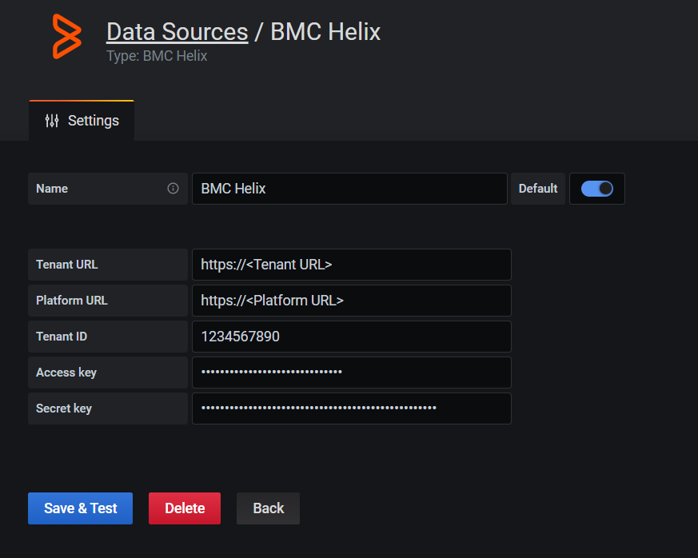

# BMC Helix Datasource

This is a Grafana datasource for fetching Metrics, Events & logs from Helix Monitor, Helix Remediate & Helix Optimize products

## Requirements

Grafana 7.0.0+ is required.

BMC Helix v21.02+ license/subscription is required

## Features

- Supports Lucene queries to fetch Events & Logs
- Supports Promql & Metricql to fetch Metrics data 
- Utilizes BMC Helix REST API's
- Secured authentication via access key and secret key

## Configuration

This datasource uses the Instana REST API to query the underlying data services.

First of all you will need to generate an Access key & Secret key in BMC Helix portal ([Keys](https://docs.bmc.com/docs/BMCHelixPortal/setting-up-api-users-for-programmatic-access-967330979.html))

Configure Retrived values as shown below

## Usage

- WIP

#### Query Types

- WIP

#### Query Editor

- WIP

### Sample Dashboards

- WIP
